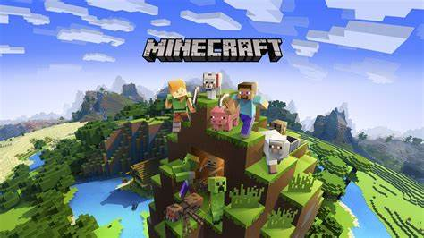

# Attention 【注意】[^1]

[^1]:Why do I say this? Because it would be strange to have a translator【关于我为什么要这么说，因为开了翻译后会很奇怪】

**I have prepared versions in multiple languages. If your browser has an automatic translation tool, please turn it off**

【**我准备了多种语言的版本，如果你的浏览器有自动翻译工具，请关掉它**】

# Main Introduction 【主要介绍】123

- 👋 Hi, I’m @Light0913 【**你好，我叫Light0913**】
- 👀 I’m interested in Minecraft 【**我对《我的世界》感兴趣**】
- 🌱 I’m currently learning Coding 【**我目前在学习信息技术**】
- 💞️ I’m looking to collaborate on "Becoming the brightest star in the night sky" 【**我希望能“成为夜空中最亮的星”**】
- 📫 How to reach me [Light0913@163.com][Light_LE@qq.com] 【**联系方式：[Light0913@163.com][Light_LE@qq.com]**】

# Detailed introduction 【详细介绍】

**Now choose your language**

【**现在，选择你的语言**】

# 简体中文 [zh_cn]

## 我的热爱

### Minecraft
  
  
  
  六岁入坑，属于我的世界正版老玩家
  
  我的微软Microsoft正版账号用户名：Light_LE

# English [en_us]

## My Love

### Minecraft

  
  
  Entering the pit at the age of six, my world's authentic veteran player

  My Microsoft legitimate account username is Light_ LE

<!---
Light0913/Light0913 is a ✨ special ✨ repository because its `README.md` (this file) appears on your GitHub profile.
You can click the Preview link to take a look at your changes.
--->
